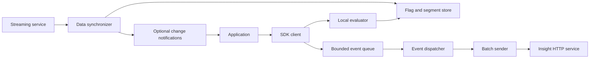

# General Requirements

[Specification index](../sdk_design_spec.md)

- Specification version: 1.0
- Reference inspection date: 2026-09-02
- Reference implementation: this repository at `fd1ed64d6a006b68ba6c29b763b7975e31fd9b12`

## Purpose and requirement levels

This document defines the implementation requirements for FeatBit server-side SDKs in other languages. It covers local feature flag evaluation, streaming synchronization, analytics delivery, lifecycle management, failure isolation, and concurrency. It applies to trusted, multi-user server applications that hold an environment secret and a complete environment data set.

**MUST** denotes a required behavior, **SHOULD** a recommended behavior whose omission requires a documented reason, and **MAY** an optional capability.

## Architecture and public API

### Components

Notes:

1. The implementation SHOULD separate these responsibilities behind internal interfaces: configuration, synchronizer, transport, store, evaluator, event processor, etc. 
2. The SDK MUST evaluate flags locally without a network request on the evaluation path. Event transmission MUST run independently of evaluation.
3. An unavailable analytics endpoint MUST NOT interrupt data synchronization or change an evaluation result.

### Client API

Each SDK MUST provide idiomatic equivalents of the operations below, except those explicitly marked optional:

| Operation | Contract |
| --- | --- |
| Create/start client | Apply configuration and start the selected synchronization mode. |
| Wait for initialization | Bounded wait or an asynchronous equivalent; distinguish timeout from terminal failure. |
| `initialized` | Whether an initial usable data state has been established. |
| `status` | `NotReady`, `Ready`, `Stale`, or `Closed`, or equivalent named states. |
| Typed variation | Evaluate a flag for a user and return the value or the caller's fallback. |
| Detailed variation | Return flag key, value, variation ID, reason kind, and reason text. |
| All variations | Return details for all active flags, without recording evaluation events. |
| Track | Record a named custom event, with numeric value defaulting to `1.0`. |
| Flush | Request asynchronous processing of pending events. |
| Flush and wait | Wait for a defined event-processing barrier within a timeout. |
| Subscribe/unsubscribe (Optional) | Observe committed local data changes. Other SDKs MAY omit this preliminary capability for now; see [Data-Change Notifications](notifications.md). |
| Close | Stop background activity and attempt a bounded final event flush. |

The .NET data-change notification implementation is preliminary and may change. Notification-specific requirements throughout this specification apply only to SDKs that implement the optional capability.

Notes:

1. Boolean, string, integer, and floating-point evaluation MUST be supported. Separate 32-bit float and 64-bit double APIs are language-dependent. If an SDK exposes a .NET-compatible integer API, its range is signed 32-bit. A JSON convenience API MAY be added; the reference only returns JSON flag values as strings.
2. Applications SHOULD retain one client per environment for the process lifetime. Multiple clients MUST isolate credentials, stores, synchronization state, and event queues. Framework integration SHOULD register the client as a singleton and close it during application shutdown.

## Diagnostics

The SDK SHOULD expose structured diagnostics for initialization, current sync status, last successful sync time, retry attempts, rejected/malformed entities, fallback reasons, queue drops, delivery failures, and shutdown timeouts. An error should identify the operation and safe entity key where possible.

Logs MUST redact environment secrets, authorization headers, and token-bearing URI query values. User attributes and event bodies MUST NOT be logged by default; payload logging, if offered, must be explicitly opt-in. Disabled logging SHOULD avoid constructing expensive messages or serializing payloads. Diagnostics MUST NOT become an unbounded workload during a prolonged outage.

## Performance and extensibility

Evaluation SHOULD perform bounded local work, with no disk/network I/O and no global lock shared with network delivery. 