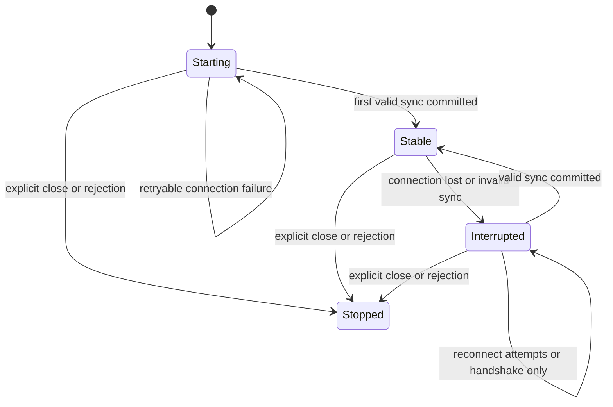

# Data Synchronization and Reconnect

[Specification index](../sdk_design_spec.md) | [General requirements](general.md)

The scope, requirement levels, and reference baseline in [General Requirements](general.md) apply to this module.

## Endpoint construction and authentication

The streaming endpoint is resolved relative to the configured base:

```text
streaming?type=server&token=<connection-token>
```

A base ending in `/featbit/` preserves that prefix. SDK documentation MUST explain this behavior or provide explicit, documented normalization. Query parameters MUST be URI-encoded.

The reference sets `User-Agent: featbit-dotnet-server-sdk`, with `X-FeatBit-User-Agent` as a fallback on restricted .NET targets. Other SDKs SHOULD identify their own language and server-side SDK consistently.

The current connection token format MUST be preserved unless the server protocol changes:

1. Remove trailing `=` characters from the environment secret, producing `secret`.
2. Obtain current Unix time in milliseconds as a decimal string `t`.
3. Choose an insertion index `p`. The reference computes `max(floor(random_0_to_1 * length(secret)), 2)`; valid secrets must be long enough for this index.
4. Encode decimal digits using the following map.
5. Produce `encode(p, 3) + encode(length(t), 2) + secret[0:p] + encode(t, length(t)) + secret[p:]`.

| Digit | 0 | 1 | 2 | 3 | 4 | 5 | 6 | 7 | 8 | 9 |
| --- | --- | --- | --- | --- | --- | --- | --- | --- | --- | --- |
| Encoded character | Q | B | W | S | P | H | D | X | Z | U |

`encode(n, width)` left-pads the decimal representation with zeroes, keeps the rightmost `width` digits, then substitutes each digit. Generate a fresh token on every connection attempt. Do not substitute JWT, Base64 encoding, or an invented bearer-token scheme. This format is reversible obfuscation, so token-bearing URLs MUST be treated as credentials in diagnostics.

## Message protocol

The SDK sends a JSON text message immediately after each successful connection:

```json
{"messageType":"data-sync","data":{"timestamp":0}}
```

`timestamp = 0` requests a full data set. Otherwise it is the maximum stored entity version, expressed as an integer Unix millisecond timestamp, and requests changes relative to that cursor. The store version includes archived records.

The server response envelope is:

```json
{
  "messageType": "data-sync",
  "data": {
    "eventType": "full",
    "featureFlags": [],
    "segments": []
  }
}
```

`eventType` is `full` or `patch`. The server may send a full replacement even when the client requested changes. Unknown top-level message types MUST be ignored without corrupting state. **Hardening requirement:** an unknown sync event type MUST NOT commit data or complete initialization.

The periodic application keepalive message is:

```json
{"messageType":"ping","data":{}}
```

This is separate from WebSocket protocol ping frames. The reference does not implement an application-level pong deadline. An SDK MAY add a documented liveness deadline if compatible with the server; it MUST NOT require an undocumented response.

Each logical JSON message MUST retain its WebSocket message boundary. Fragmented frames MUST be reassembled before parsing. Implementations MUST serialize concurrent outbound writes so that keepalive and sync JSON cannot interleave or be accidentally concatenated into one JSON message.

## Full and patch processing

For a full response, build a replacement data set and replace all previous flags and segments. Items absent from the replacement disappear, regardless of their old versions. An empty full response clears the store.

For a patch, insert an unknown entity or replace an existing entity only when `incoming.version > stored.version`. Equal and older versions are no-ops. Apply archives as versioned records rather than physical deletions.

After a valid response, the new SDK MUST perform this observable sequence:

1. Commit the complete store update.
2. Set synchronization status to `Stable` and establish `initialized = true` on first success.
3. Complete the initialization promise, if pending.

**Hardening requirements:** full replacement and an entire patch batch MUST be atomic with respect to evaluation. If [data-change notifications](notifications.md) are implemented, readiness and initialization MUST be visible before user callbacks run. SDKs MAY omit these notifications for now.

A valid no-op patch still establishes that synchronization succeeded and may restore `Ready`; it does not require a data-change notification. In the baseline, a valid patch can initialize a synchronizer with an already populated store. Public online bootstrap/persistent-store behavior remains an extension.

## States

| Synchronizer state | Public status | Evaluation behavior |
| --- | --- | --- |
| `Starting` | `NotReady` | Fallback until initial synchronization succeeds. |
| `Stable` | `Ready` | Evaluate committed local data. |
| `Interrupted` | `Stale` | Continue evaluating the last committed data. |
| `Stopped` | `Closed` | No synchronization; retained initialized data remains locally evaluable. |

New SDKs MUST preserve local evaluation from retained initialized data after close, while suppressing new analytics and other background work. If initialization never succeeded, closed-client evaluation still returns the caller's fallback.



Offline initialization enters `Stable` directly. For new SDKs, `Stopped` is terminal for a client instance; restarting requires a new client.

## Reconnect policy

| Trigger | Required action |
| --- | --- |
| Transient initial connect failure or timeout | Retry in the background; remain `NotReady`. |
| Abrupt disconnect or missing close status | Reconnect. |
| Server normal closure, code `1000` | Reconnect unless the client explicitly stopped. |
| Other server close codes, except `4003` | Reconnect under the reference policy. |
| Server rejection, code `4003` | Stop permanently for this client instance. |
| Explicit client close | Cancel retries and stop permanently. |

The default delay is `delays[attempt % length(delays)]`: after 55 seconds the default schedule cycles back to zero. It does not cap at 55 seconds forever. Attempts reset after a successful connection. There is no default retry-count limit.

A configurable exponential-backoff-with-jitter policy MAY be provided. The repository contains a separate jitter policy, but the WebSocket wrapper uses the configured delay array.

**Hardening requirements:** only one active reconnect operation may exist per client. Retry waits and connection attempts MUST be cancellable. Track reconnect work and join it during close before releasing its transport state. Associate asynchronous completions with their connection generation so an obsolete attempt cannot resurrect a stopped client or replace a newer connection.

On reconnect, request synchronization again using the retained store cursor. A restored socket MUST NOT mark stale data fresh before a valid response commits. Server restarts MUST recover even when the server closes normally.
